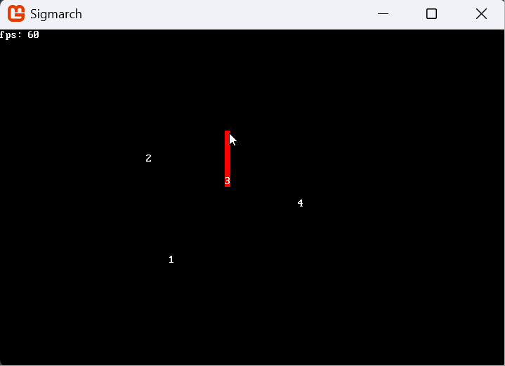

+++
author = "Iris"
title = "Developing a Roguelike - Part 1"
date = "2025-07-22"
description = "Starting development on the RoguelikeDev challenge"
tags = [
    "roguelike",
    "C#",
]
+++

While I have been browsing the [RoguelikeDev](reddit.com/r/roguelikedev) subreddit for a few years now, I've always
been more of a lurker than an active member of the community. I've decided this time it would be different.

I find roguelikes extremely interesting. I enjoy _crunchy_ games, I enjoy complicated mechanics, and I love learning.
Roguelikes are usually perfect for this by their very nature. Complexity for the sake of complexity is bad and yadda yadda,
yes, and I like to turn off my brain after work as much as the next person, but sometimes you just want to bite down
on some juicy system and I think they provide that in spades.

I've also always been fascinated with the idea of creating _my own_ roguelike. The RoguelikeDev community has two
yearly events that I'm aware of: 7DRL, a 7 day game jam, and 'RoguelikeDev Does The Complete Roguelike Tutorial', an
event where the aim is, like the name suggests, to complete the tutorial to get a basic roguelike started. In fact,
there's several versions of the tutorials, some more complete than others, depending on the language and framework
you prefer to use.

This year I felt particularly inspired to be part of it, so I decided to give it a shot myself.

### The Basic Premise (aka I Yap About Roguelikes)

The tutorial has you go through the motions of creating a very old school roguelike--you move around on a map made of
square rooms and corridors connecting them, you bump into monsters, you go down to the next floor. Rinse, repeat.
This is great to get you started if you haven't done anything of the sort before! But I decided to challenge myself,
and try out something different.

The main concept for my project is pretty simple, and something I've been thinking about for a while. All roguelikes
I've seen have you play as a single character, despite orginally being based on TTRPGs, which usually have a party of
multiple people. How would a roguelike play, if you could control more than one character? I'm not sure I've seen
this idea explored before. Usually, if you have companions, you have limited control over them.

With that as the main focus, I started thinking about the game at large. I tried to imagine what
exploration would be like, and how a combat encounter would play out. However, they both seemed like they would
be pretty uninteresting. Exploration would probably be more annoying than anything else if you had to micromanage 4
characters at the same time just to go from point A to point B. I could see some occasions where it might turn out
to be compelling, for example by having the rogue scout ahead in stealth and have the party follow behind, or
separate them in order to solve a puzzle, or approach a situation from a different angle. But would this be interesting
enough to overlook the boring part?

Combat is a bit trickier. Generally speaking, I dislike the roguelike approach to combat. It often revolves around
placing yourself in a way that you can funnel enemies through a single tile, then bumping against them. I find the interesting
parts of combat to be not the combat itself, but the decisions that lead to (and derive from) it. Should I fight this enemy
or run? Should I pop this potion? Should I retreat and lick my wounds, or try to finish them off? And... would this work
in a world where you have multiple characters? Would this lead to more engaging gameplay if you can just funnel enemies
through a corridor, but this time you can _also_ shoot them from afar _and_ circle behind them for a flank? Not to
mention this would increase the time it takes for a single turn from the press of a button to multiple buttons (and
trying to remember where every character is in relation to the enemies).

It stands to reason that the enemies should also be able to do something like the player, otherwise there would be
a significant imbalance between the two. This means that they would probably have to be spawned as _packs_ of
enemies rather than individual ones. They'd probably need to have different specializations as well, just like
you can have a fighter, a wizard, and a ranger in a party. And also... they'd have to be smarter than just "path towards
the player". If enemies never react to flanking, then flanking just becomes the most obvious tactic to employ
every single time. And that's not a decision, so it turns back around to being boring. I know some roguelikes
have enemies smarter than that, but frankly it seems both pretty hard to implement and overkill for what is meant
to be a "get a basic roguelike going" kinda deal.

Now, it seems like everything I've talked about for the past few paragraphs would make me go "actually, having
a whole party seems to bring a lot of issues! I should try something different". And yes, part of me did think that,
but it also enlightened some characteristics we _would_ need to have for the concept to work:
- __Exploration should be limited.__ Having to press 'up' on 4 characters to have them all move north one tile
is a no-go.
- __Enemies should be unique.__ Just like the player can have characters that do different things, enemies should
be able to do different things as well. An encounter where you're facing 4 orc brutes who just charge at the closest
character and bump into it is not interesting.
- __The encounter _itself_ should be engaging.__ This is more of a personal goal. I know there's people who do
enjoy traditional roguelike combat, but I think it'd be a waste to be the combat just bumping into enemies after
discussing the previous point. My favorite roguelike is [Tales of Maj'Eyal](https://te4.org/). I'm not planning on
having that many abilities per character, but every turn should force you to make a decision on what you want to do.

### Let's Design a Roguelike, Then

I believe I've found an elegant way to fulfill those conditions, while avoiding the risks I've mentioned in the previous
paragraph. The solution is to simply get rid of the dungeon aspect wholesale.

The basic premise remains the same: you control a party of characters. However, you are now in an arena. And you're
facing another party of characters. Each character has a class, which defines the abilities you have access to.
After beating the enemy party, you can upgrade your abilities and learn new ones, then you're thrown into another
arena match.

This concept is particularly intriguing to me. The core is pretty simple, and should be possible to do in a limited
time (well, the ability part scares me because that seems to be something deceptively simple to implement). I am also
fascinated by the idea of having more utility-focused abilities than what might be relevant in a dungeon. For example,
a wizard could summon an earthen wall to block line of sight from the enemy ranger. The ranger could then use their
eagle companion to get vision and decide where to reposition. This would also be very scalable if I decided to keep
working on this past what the tutorial requires.

For the moment to moment gameplay, I'm envisioning every character having a number of action slots per round. For example,
you could move and swing your sword, or move twice, or swing your sword and cast _cone of cold_. Maybe stronger abilities
could require multiple slots.

As i'm writing this, the idea seems to be turning more into a tactics game than a roguelike. At what point does it actually
stop being a roguelike? I don't think it particularly matters. I'm not really a purist of the genre and I think
it's more important that I work on something that seems fun to do, rather than something that would be more correct.
I'll probably just use the tutorial as a rough guideline of what should be done by what point.

### To C or not to C?

I usually take projects like these as a way to learn something new about the language I'm using. I already went through the
tutorial by myself a couple years ago on Python, so I knew from the start that's not what I would be using.
I've considered both Odin and Zig as possible candidates. I've used both of them for the first time in recent projects and,
while I wasn't amazed, I know people _really_ like them. Maybe it would be the perfect chance to find out more why that is.
However, what dissuaded me is that there's no native bindings for `libtcod` or similar out of the box, so it would add another layer
of stuff to do on top of... you know... _actually making the game_. I wanted a more ready-to-go solution.

I then considered C++. I'm not an engineer, but I do use some C++ here and there in my day job. I was also interested in checking
out some of the more modern features. Yeah, C++ is not really a comfortable language, but I do have _some_ experience with it already.
Then I remembered how much of a pain setting up the environment for a C++ project is, and how frustrating it is to track down
some mysterious compiler error sometimes, and changed my mind. I'll use C++ for a 'for fun' project someday, but not now.

So with that gone, I turned my head towards Rust. People _love_ Rust. And people _love_ telling you they love Rust. I've tried
it myself a couple times, but always found it a bit clunky. "Maybe it's because I didn't have enough experience!" I told myself.
After all, the last time I touched it was a couple years ago. I started looking into it, and the more I read about it the more
it seemed like it would be the best option for what I was trying to do. Then I read about the borrow checker. I think Rust can
work for bigger team projects, where you have engineers dedicated exclusively towards making sure they're writing good code.
However, I don't want to deal with that, especially on a project like this. I'm not trying to write good code, I'm trying to get
a game running. I would trade code cleanliness for comfort in a heartbeat.

All those options exhausted, I finally looked at C#. I've had friends tell me C# is the most comfortable language for a while now.
I myself have looked into it several times, first to use Unity back when I was in high school, then when I found out about Blazor a few years ago.
The whole environment seems very painless. The community is huge. It's cross platform. There's a library called [SadConsole](https://sadconsole.com/) specifically
for building roguelikes. It just _works_. So I went for this option. I'm very curious to see how I'll feel about it by the end of the project.

### The Implementation

Believe it or not, we're finally at the part where stuff is actually happening on my computer.
The week before the challenge started (it's not really a challenge, but i'm not sure how else to refer to it) I made sure to go through
the tutorial on the SadConsole website. It's incomplete, but it does have all I needed to get started: how to render stuff, and
how to process keyboard input.

At the start of the week, I created a new project. The name I've settled on for now is Sigmarch. It sounds fantasy
enough, it sounds tactical enough, and I think the -march part works well to evoke the idea of 'multiple units'.

C# does seem as comfy to use as advertised. SadConsole, similarly, is also pretty intuitive. 

The basic project is set up very similarly to what the website recommends: I spin up a Screen, which holds a Surface, on top of
which I render the World. Now, the first difference I have to deal with is that I want to control more than one character.
What's the best way to do that?

My approach was to just give Actors a Faction whenever they're created, then add all Actors of the same faction to a Queue. The first actor
in the queue is popped out, and _stuff_ can be done to it. Once the actor is done, we pop the next actor, and so on.
This keeps going until the Queue is empty, at which point it gets repopulated. This seems reasonable enough to me.
I've also gotten to use `LINQ`, a query system that exists in C#:
```csharp {style=catppuccin-mocha}
foreach (var actor in Actors.Where(actor => actor.Faction == Faction.Ally))
{
    ActivatableAllies.Enqueue(actor);
}
```
It's also interesting to me that C# is quite a bit more high level than I'm used to, which leads to the previous function being
somewhat confusing to me. I assume what's happening is that ActivatableAllies now owns a reference to the
actor which is _also_ in Actors, but this seems a bit alien to me since I'm used to having to pass references explicitely.

The only other noteworthy thing I did was to make movement be reliant on the mouse position, since I'm expecting characters to be able to 
move multiple tiles in a single turn.

This is what I have so far: four units that can move across the map, and a line to show which path they'd take
(there's no actual pathfinding yet though). 



If you want, you can check out the full repo [at this link](https://github.com/IrisLikeThePlant/Sigmarch)