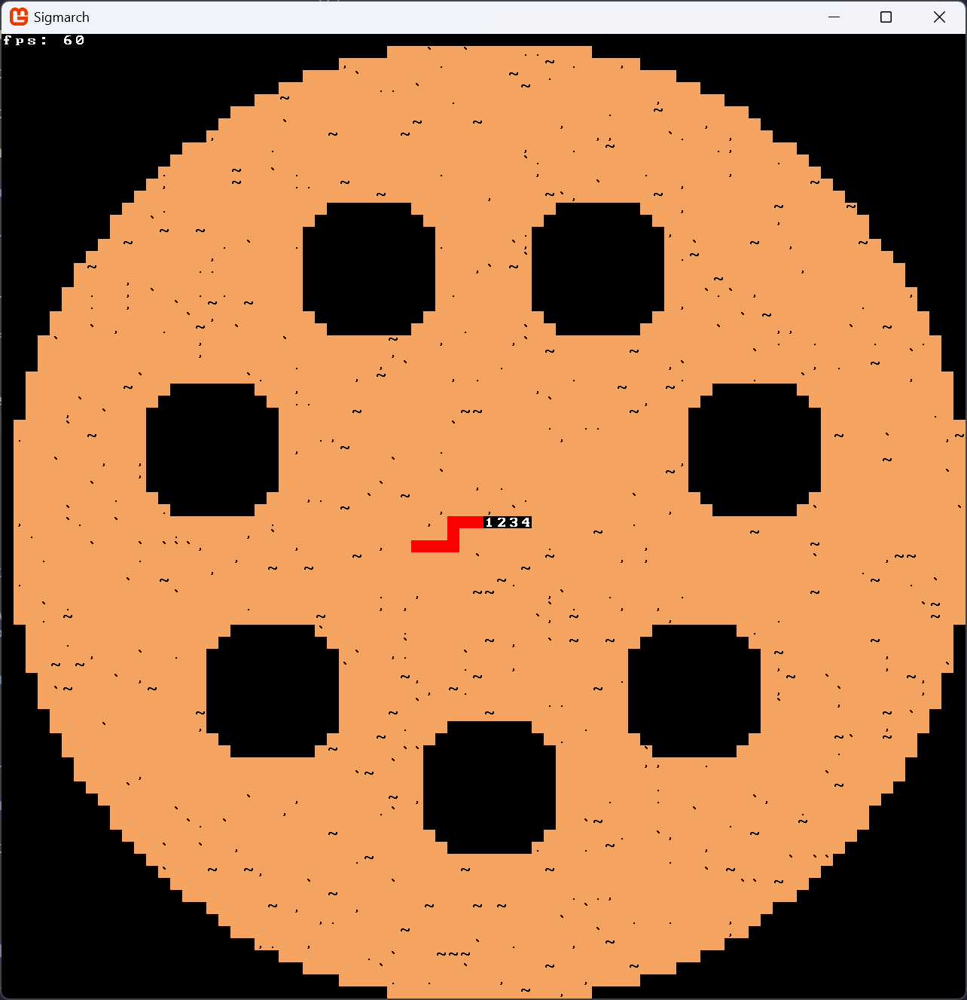
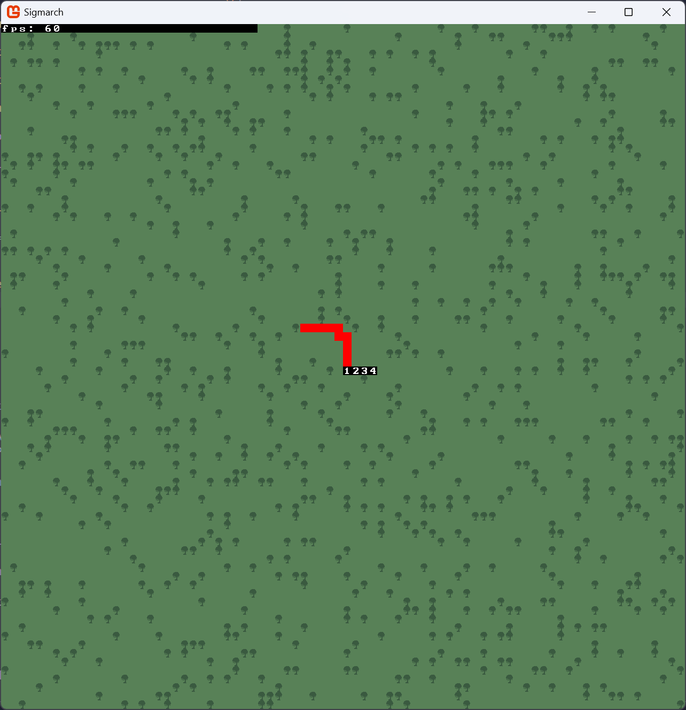
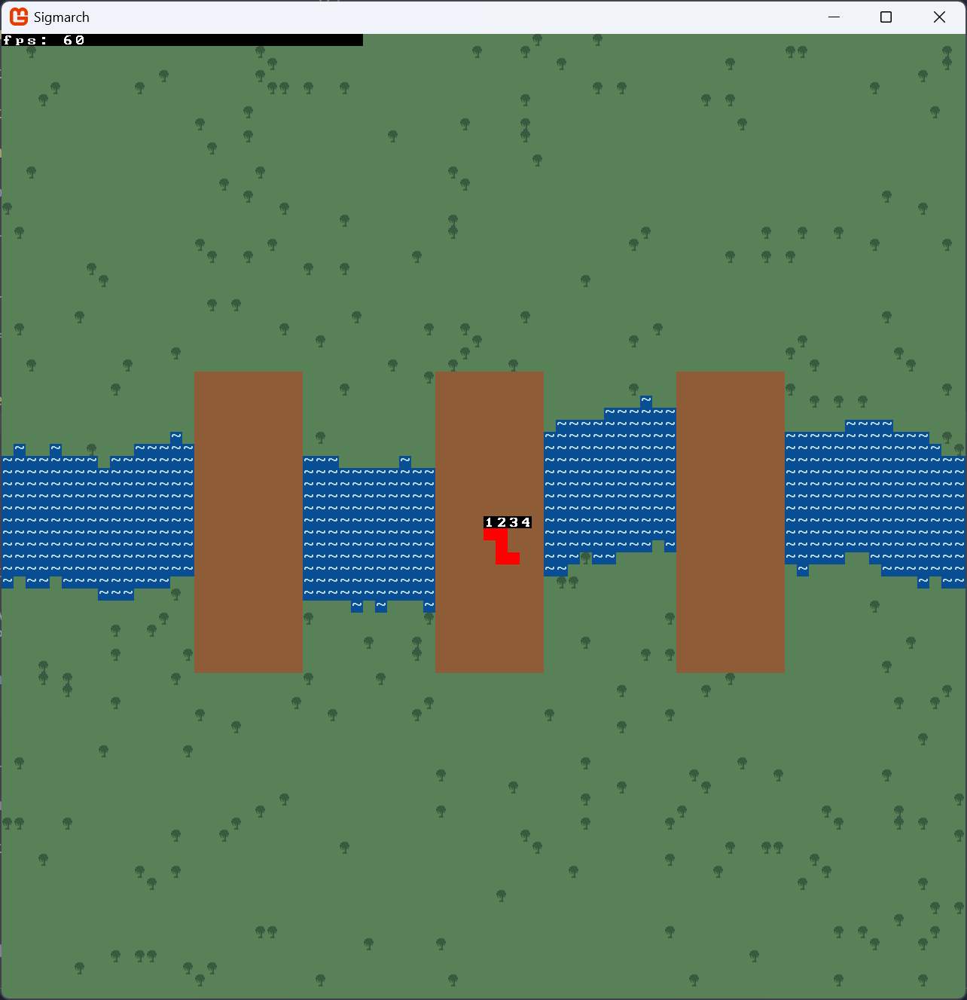

+++
author = "Iris"
title = "Developing a Roguelike - Part 2"
date = "2025-07-27"
description = "Writing a map generator"
tags = [
    "roguelike",
    "C#",
]
+++

*As always, you can check out the full repo [here](https://github.com/IrisLikeThePlant/Sigmarch)*

### Map generation

Interestingly enough, I already worked on a lot of this week's stuff [in my previous entry](/blog/01_developing_a_roguelike_part_1/)
(specifically, everything related to an Actor data structure and a World which contains tiles and actors).

I spent most of my time working on the project writing a map generator. Like I already mentioned, I am not interested
in having the characters navigate through a dungeon made of square rooms and corridors. I had 3 specific types of maps I wanted
to include in my game:

**Arena**: a smaller, round map. This map contains a few "pillars" that are meant to obscure visibility from afar, but also
has a big open space in the middle to brawl.

I've added a bunch of little characters like `.` and `,` to spice up the terrain a bit. I like it, it makes it seem like there's
little mounds of dust or trash on the field. 

**Forest**: a wide area with a ton of trees that can easily hide characters. This is hopefully gonna turn out a lot better
once I implement the viewshed. The numerous obstacles should make it hard for ranged characters to use their abilities,
and abilities that grant vision should be much more important here.

My main issue with the current looks is that the trees, which are meant to be obstacles, don't immediately *pop out* to
the player as such. Hopefully the viewshed will make it clearer, but worst case scenario I'm probably just going to
color them black rather than dark green. I also tried to give it the same treatment as the Arena by adding a bunch of
little simbols for some variety but the map turned out to be way too confusing visually. Replacing the ground tiles with
different shades of green also gave it a very distinct *static noise* feel which I wasn't vibing with. A better
implementation would probably be to use some Perlin noise to delineate areas with different kinds of vegetation,
but that seems to be unnecessary polish at this stage. Probably something to keep in mind for the final week of the project.

**River**: an open-ish field with a big river going through the middle and 3 bridges connecting the two banks. The wide
open areas and limited amount of ways to get to the other side should make this map harder to deal with for melee
characters.

It's very easy to see that this is the least developed map, but I was running out of time and didn't want to spend
too much of it trying to make the bridges look good. Depending on how the river is generated, sometimes one of
the bridges will not manage to connect both river banks... but I've decided to keep it as a known issue for now.
Similar to the forest, a little polish could go a long way here.

I've also replaced the default tileset with a different one ([LCD by Agm](https://dwarffortresswiki.org/index.php/File:LCD_Tileset.png))
and started working on an implementation of A* pathfinding. I briefly considered adding the [GoRogue](http://www.roguelib.com/) library to help
me avoid having to re-implement a bunch of algorithms from scratch, but frankly I don't feel like refactoring a bunch
of code for a short project like this one unless it becomes absolutely necessary (and turns out implementing algorithms can be kinda fun!)

Looking ahead, it seems like this week is gonna be *a lot* of work, as
I'd like to start working on generic implementation of a bunch of different abilities. I'm still not sure
of the best way to do that, but I assume it's going to involve a bunch of abstract classes and good old try and error.